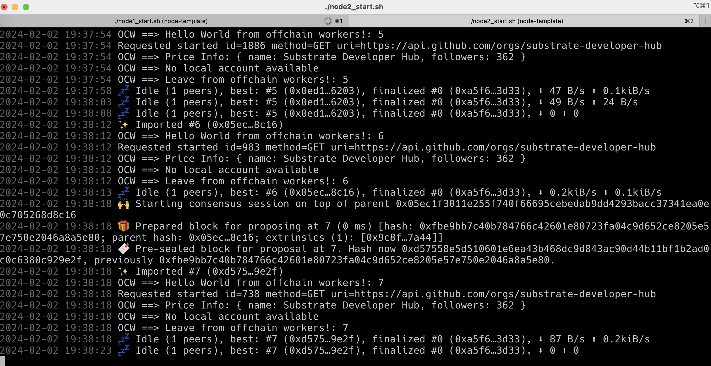
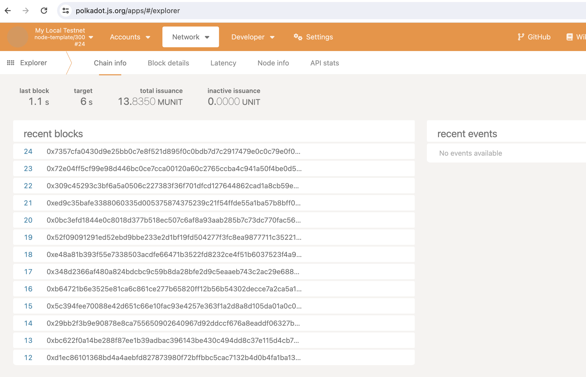
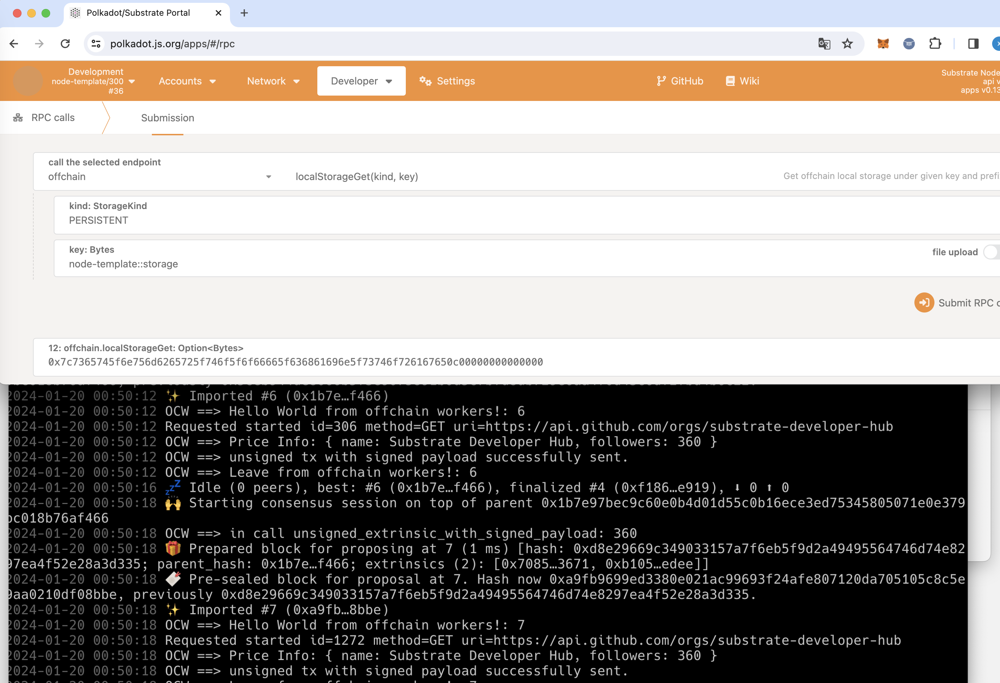
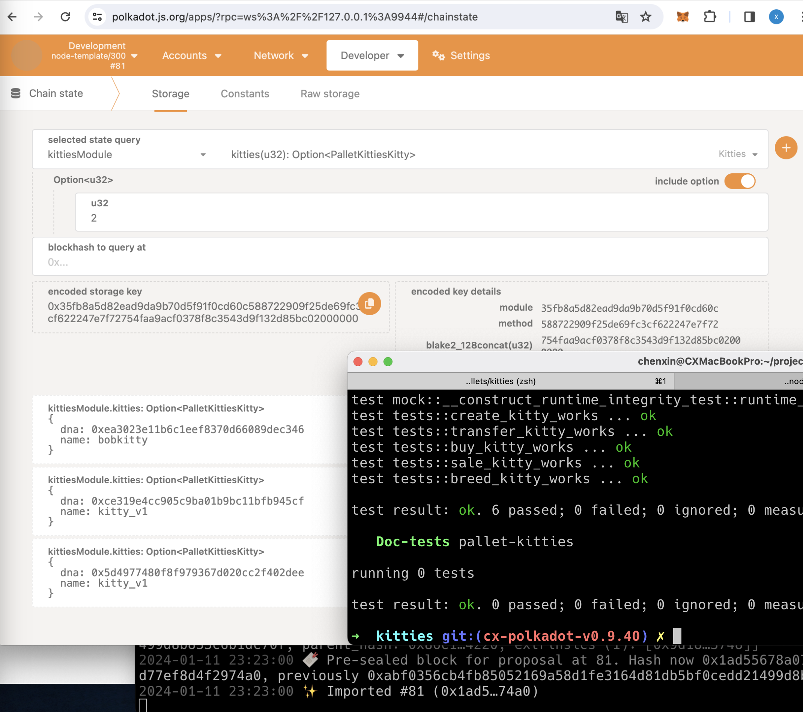
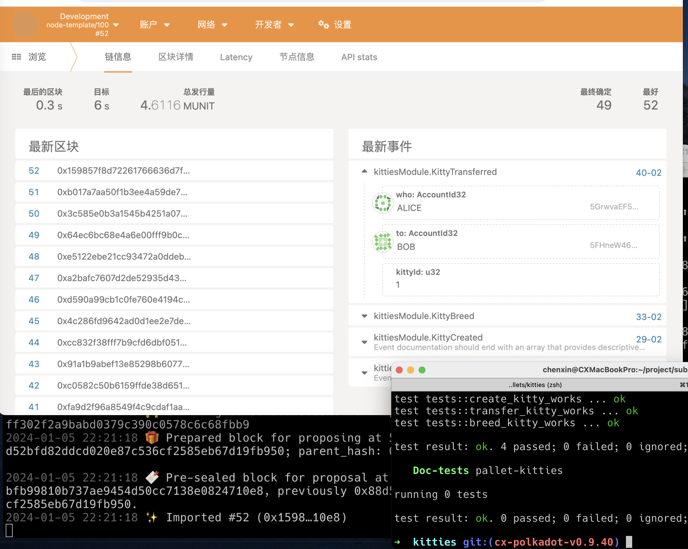

第六课：
生成key在 ./key.txt，共两组，输入密码全部是:111111
步骤：
1. `./node1_start.sh`  启动节点，然后停止, identity is: `12D3KooWPY4T8DbbgwPvgaoqk12UYg4krTqo42CgyfGEdxR7jK6m`
2. `./add_key1.sh` 
3. `./add_key2.sh`  
4. `ls /tmp/node01/chains/local_testnet/keystore`
5. `./node1_start.sh` 启动节点
6. 修改`./node2_start.sh` 写入第一个节点 identity
7. `./node2_start.sh` 启动第二个节点，然后停止
8. `./add_key3.sh`
9. `./add_key4.sh`
10. `ls /tmp/node01/chains/local_testnet/keystore`
11. `./node2_start.sh` 启动第二个节点

第四课：

第三课：

第二课：
